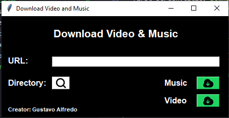

# App Download Music Video
### 🕹️ Functions
- 1 - Download Music 
- 2 - Download Video

### 🖥️ Technologies:
##### Backend: [Python] 

### 📚 Librarys:
##### Frontend: [Tkinter] 
##### Download Video and Music: [YT-DLP] 

### 🔨 Tools:
##### IDEA 1: [VS Code]

### 📷 Project images
 

### 🚨 Attention
##### 🚨 This project does not aim to break any restrictions on the YouTube platform. This was developed with didactic objectives. Its developer is not responsible for any misuse of its project. 🚨

[Python]: <https://www.python.org/>
[VS Code]: <https://code.visualstudio.com/>
[Tkinter]: <https://docs.python.org/pt-br/3/library/tkinter.html>
[YT-DLP]: <https://github.com/yt-dlp/yt-dlp#embedding-yt-dlp>